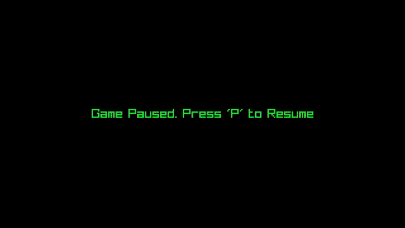

2D Top-Down Racing Car Game

Overview

This project is a 2D top-down racing car game developed using C++ and the raylib library. The game features dynamic movement, animated sprites, collision detection, and interactive gameplay elements such as health tracking, score systems, and speed boosts. It provides a fun and engaging experience while demonstrating core game development techniques.

Features:

->Player Controls: Smooth diagonal movement of the car with keyboard input.

->Camera Tracking: The camera follows the car as it moves along the track.

->Collision Detection: Interactions between the car and obstacles or power-ups.

Game Mechanics:

->Health system to track collisions.

->Speed boosts for increased gameplay intensity.

->Scoring system to track progress.

->Graphics and Animation: Animated car sprites and dynamic backgrounds.

Audio Effects: Integrated sound effects for collisions, engine noise, and background music.

Performance Optimization: Efficient use of resources for smooth gameplay.

How to Play:

->Clone this repository to your local machine.

->Ensure you have raylib installed on your system.

->Visit raylib's installation guide for instructions.

->Navigate to the project directory and build the game.

Use the arrow keys or WASD to control the car and avoid obstacles while collecting power-ups.

Requirements

C++ Compiler (e.g., g++, clang++)

raylib Library

Compatible with Windows, macOS, and Linux.

Project Structure

2d-racing-car-game/
├── resources/            # Contains sprites and audio files
├── src/                  # Source code
    ├── main.cpp          # Main game source code
├── README.md             # Project documentation
└── LICENSE               # Project license

Gameplay

License

This project is licensed under the MIT License.

Contributing

Contributions are welcome! Please fork this repository and submit a pull request with your improvements.

Contact

For questions or feedback, please reach out to tambweamani@gmail.com or open an issue in this repository.